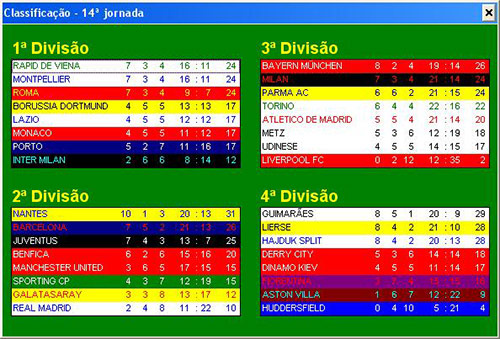

# O que é a série LESS?

A série LESS consiste em reescrever uma página de alguns softwares e sites, sem olhar o código fonte do mesmo.

A ideia é entrar no site, tirar um print screen e fechá-lo. Não utilizar nenhum software externo além do próprio editor de código.

Explicado isto, com certeza muitas referências à cores, fontes, margens, espaçamentos e tamanhos serão diferentes das utilizadas pelo site alvo, pois, utilizarei apenas a "intuição" como base para tal.

É apenas um exercício pessoal para fins didáticos, imaginando como eu faria, podendo inclsuive fazer alterações que julgue necessário, sem necessidade de total fidalidade ao layout.

# Requisitos

1. HTML Semântico
2. Responsivo
3. Mobile first

# LESS Elifoot

* Jogo: Elifoot
* Páginas: Capa, Classificação e Jogo
* Versão: Elifoot 98

# Página Classificação

## Versão original

## Versão desenvolvida

### Desktop

### Mobile

